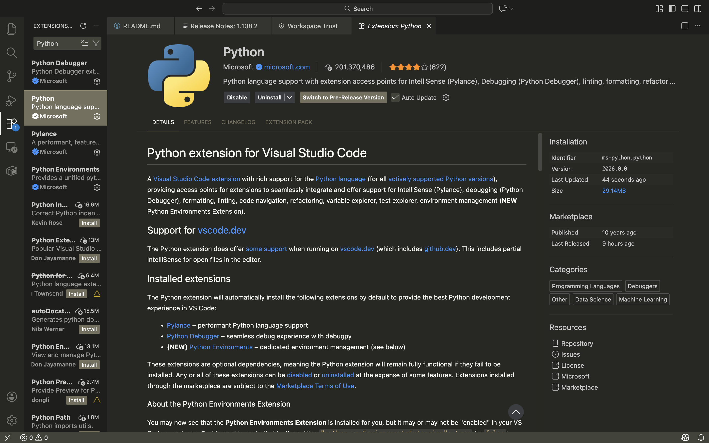
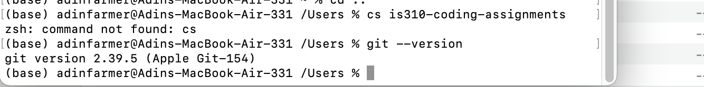
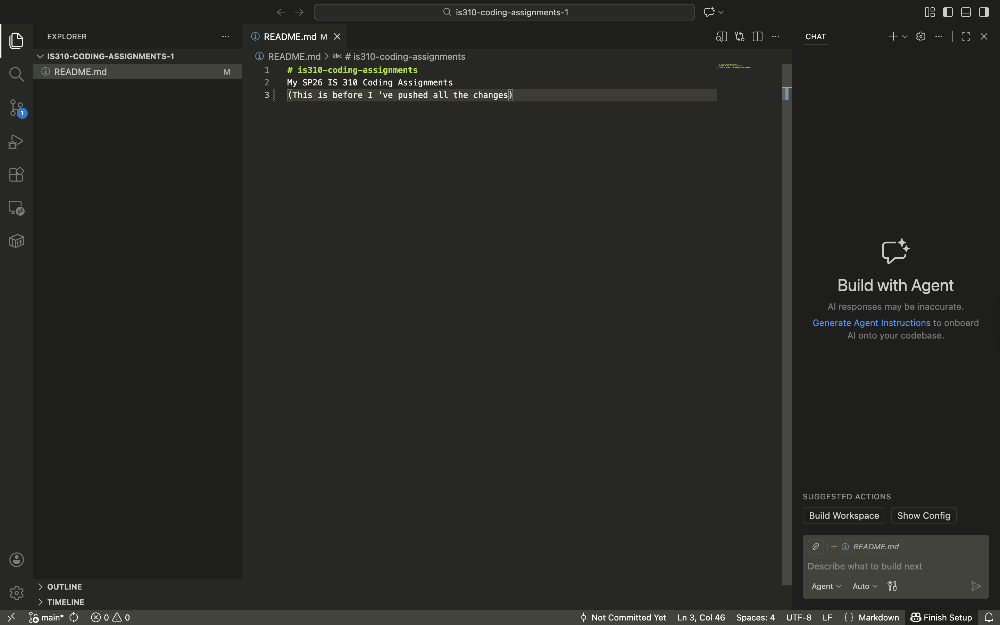

# Init IS310 Homework

## Proof of Installation
Hypothesis Username: adinf
1. Python

2. Git

3. VS Code

4. AI Tool/Workflow 
 I plan to use Copilot AI in Visual Studio Code. Admittedly, I've never used this tool before, so I don't know what it can do, but I don't love using AI, so I don't plan to use it a ton.
How will you work with AI? What tools if any do you plan to use?

